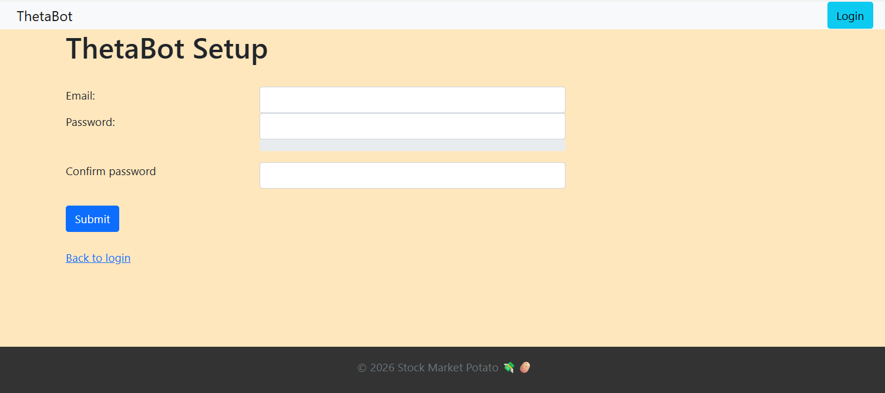
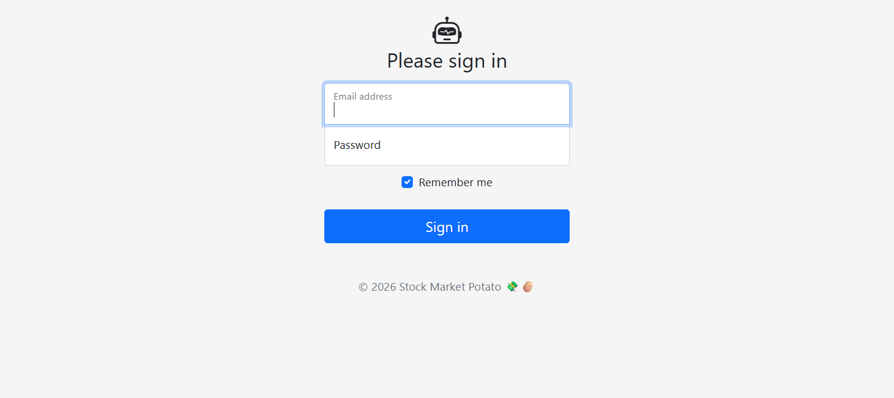
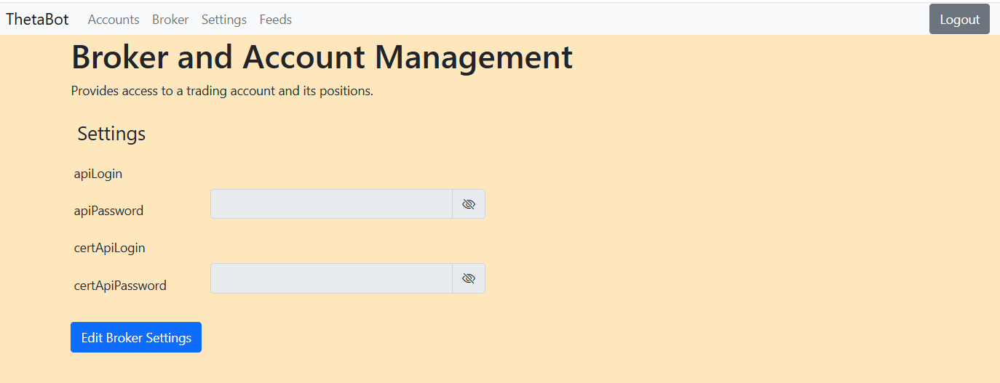

**Note:** This project is no longer maintained.

# Stock Market Potato - ThetaBot

ThetaBot is a Spring Boot application designed for automated trading and portfolio management, specifically integrated with the Tastytrade brokerage. It includes a web interface for user management, bot configuration, and trade monitoring.

This bot implements the **Theta Engine (Short Put, 45 DTE Income Strategy)** strategy proposed by David Sun presented in his podcast *The Trade Busters*.

## Strategy Mechanics: 45 DTE Income Strategy

### Entry
*   Sell SPX or SPY (or /ES) put 3 times a week: Monday, Wednesday, and Friday.
*   Sell closest to 45 DTE and go further out.
*   Start at target DTE and move towards higher DTE (50, 55).
*   Max delta is 5.

### Exit
*   Bracket order:
    *   60% Make Profit.
    *   2x Stop Loss (option price hits 3x credit).
*   Exit at 21 DTE no matter what.
*   Do not reestablish when stopped.

Instead of SPX / SPY, this bot was tested with /ES. Since Tastytrade did not offer bracket orders for future options at the time of development, a polling mechainsm was implemented to actively watch for the stop loss periodically.

The Bombshelter is not implemented. This means only the short leg is traded. No hedging is done!

## Project Structure

The source code is organized into the following packages:

### Java Packages (`src/main/java`)

*   **`com.stockmarketpotato.accounts`**
    *   Manages user entities, profiles, and account-specific data. Handles the business logic for user registration and management.
*   **`com.stockmarketpotato.bot`**
    *   Contains the core logic for the trading bot, including strategy implementations and automated execution engines.
*   **`com.stockmarketpotato.broker`**
    *   Defines generic interfaces and abstractions for broker interactions, allowing the bot to be decoupled from specific brokerage implementations.
*   **`com.stockmarketpotato.configuration`**
    *   Spring Boot configuration classes (e.g., Bean definitions, WebMvc config, Async config).
*   **`com.stockmarketpotato.feeds`**
    *   Handlers for incoming market data feeds, responsible for parsing and distributing price and quote data to the bot.
*   **`com.stockmarketpotato.integration`**
    *   **`tastytrade`**: Specific implementation for the Tastytrade API. Handles authentication, order placement, balance retrieval, and position tracking with Tastytrade.
    *   **`tradingcalendar`**: Integration with trading calendar services to determine market hours and holidays.
*   **`com.stockmarketpotato.main`**
    *   Contains the main application entry point (`ThetaBotApplication`).
*   **`com.stockmarketpotato.notification`**
    *   Services for sending notifications to users (e.g., email alerts for trade executions or security events).
*   **`com.stockmarketpotato.security`**
    *   Handles application security, including Spring Security configuration, authentication providers, and session management.
    *   **`validation`**: Custom validation logic for user inputs and form data.
*   **`com.stockmarketpotato.tradelog`**
    *   Components responsible for recording trade history, performance metrics, and generating logs for auditing.

### Resources (`src/main/resources`)

*   **`keystore`**: Contains SSL certificates (e.g., `thetabot.p12`) for enabling HTTPS.
*   **`static`**: Static web assets such as CSS, JavaScript, and images.
*   **`templates`**: Thymeleaf HTML templates for the server-side rendered UI.

## Configuration

### Prerequisites

1.  **Java JDK**: Ensure a compatible JDK is installed (JAVA_HOME set).
2.  **Keystore**: A valid keystore file must be present at `src/main/resources/keystore/thetabot.p12`.
3.  **Trading Calendar**: The application depends on the Trading Calendar service.
    *   **Docker Image**: apptasticsoftware/trading-calendar
    *   The container must be running and accessible by the application.

### Application Settings

The application is configured via `application.yml`.

**Important:** `application.yml` is not included in the repository to protect sensitive secrets.
1. Copy `src/main/resources/application.example.yml` to `src/main/resources/application.yml`.
2. Fill in your API credentials and keystore passwords in the new `application.yml`.

For running tests, a similar configuration is required:
1. Copy `src/test/resources/application.example.yml` to `src/test/resources/application.yml`.
2. Ensure the credentials are set correctly for the test environment (specifically the certification environment credentials).

Key settings include:

*   **Database**: Uses an embedded H2 database (`jdbc:h2:file:~/thetabot-h2-db`) with Hibernate for persistence.
*   **Server**: Configured to run on port `443` (HTTPS) requiring a PKCS12 keystore.
*   **Security**: SSL is enabled by default.
*   **Trading Calendar**:
    *   Service endpoints are defined in `src\main\java\com\stockmarketpotato\integration\tradingcalendar\TradingCalendar.java`.
    *   `MARKETS_HOURS_URL`: `"http://<...>/api/v1/markets/hours"`
    *   `MARKETS_STATUS_URL`: `"http://<...>/api/v1/markets/status"`

### SSL Configuration

Scripts to generate the required keystore and certificates are located in `src/main/resources/keystore`:
*   `gen-keystore.sh`: Generates the keystore.
*   `gen-sslcert.sh`: Generates the SSL certificate.

After generation, ensure the `key-store-password` in `application.yml` matches. Also copy the key configuration to `src/test/resources/application.yml` for running tests.

### First Run Setup

1. After the first start: setup the credentials, ... 

2. ... then go to the login screen.

3. Navigate to the Broker page and enter your API credentials. Cert API is optional.

4. Create a new bot configuration at the bottom of the main page.

## Building and Running

The project uses the Maven Wrapper for easy building.

### Build

```bash
./mvnw wrapper:wrapper
./mvnw clean package -DskipTests
```

### Docs

```bash
mvn javadoc:javadoc
```

Docs are generated to `target\site\apidocs\index.html`

### Run

```bash
./mvnw spring-boot:run
```

Once running, the application is accessible at `https://localhost/`.

### H2 Console

The H2 database console is enabled and mapped to `/h2`.

## Features

*   **User Management**: Registration, Login, Password Reset.
*   **Tastytrade Integration**:
    *   Fetch Net Liquidating Value history.
    *   Monitor live orders and positions.
    *   Place and manage orders (Dry Run supported).
*   **Web UI**: Thymeleaf-based interface for managing the bot and viewing account status.


## ⚠️ Disclaimer

**I am not a financial advisor.** This software is for educational purposes only. Only use it with the tastytrade certification environment and not for real trading.
Trading involves risk. Using automated trading tools and API keys always carries a risk of software failure or security breaches.

**Trading short positions (selling options) involves significant risk and can result in losses greater than the invested capital.**

**Use this tool at your own risk.** Ensure your API keys are kept secure and are never shared.
